# Superpowers Cheat Sheet

Quick reference guide for all 14 Superpowers skills with one-liners, detailed descriptions, and workflow diagrams.

---

## The 14 Skills

### 🎯 Core Workflow

#### `/brainstorm` (brainstorming)
**One-liner:** Explore ideas through Socratic dialogue before starting creative work.

Activates when you need to design something new or explore alternatives. It asks questions to understand your intent, explores 2-3 different approaches with trade-offs, then presents the design in sections for validation. Use this BEFORE `/write-plan` when you're uncertain about architecture or need to explore design space. The skill breaks down questions into single, digestible queries and validates incrementally.

**When to use:** Designing features, exploring architecture, starting new projects, uncertain about approach  
**Output:** Validated design document saved to git

---

#### `/write-plan` (writing-plans)
**One-liner:** Create comprehensive, bite-sized implementation plans with exact file paths and complete code.

Transforms validated designs into detailed task breakdowns (2-5 minutes each). Every task includes exact file paths, complete code snippets, verification commands, and expected outputs. Assumes the engineer knows their language but nothing about your codebase. Follows strict TDD methodology (RED-GREEN-REFACTOR per task). Save plans to `docs/plans/YYYY-MM-DD-<feature>.md`.

**When to use:** After design approval, before implementation, executing complex multi-step work  
**Output:** Detailed implementation plan with 10+ bite-sized tasks

---

#### `/execute-plan` (executing-plans)
**One-liner:** Execute implementation plans with batch processing and human review checkpoints.

Loads a written plan, reviews it critically, executes tasks in batches, then stops for architect review between batches. Suitable for separate sessions with checkpoints. Runs 3-5 tasks, reports progress, waits for human validation, then continues. Good for when you need explicit control points rather than autonomous execution.

**When to use:** Executing plans in separate sessions, need explicit checkpoints, architectural decisions required between batches  
**Output:** Completed tasks with progress reports between batches

---

### 🧪 Testing & Debugging

#### `/tdd` (test-driven-development)
**One-liner:** RED-GREEN-REFACTOR: write failing test, watch fail, write minimal code, watch pass, commit.

Enforces strict TDD discipline. NEVER write implementation code before tests. If you write code first, delete it. Watch tests fail (RED phase) with the right error. Write minimal code to pass (GREEN phase). Refactor while tests stay green (REFACTOR phase). Commit after each cycle. This is non-negotiable - it prevents rationalizing away test coverage.

**When to use:** Any feature implementation, any bugfix, refactoring, behavior changes  
**Anti-patterns:** Writing code first, skipping tests for "simple" changes, not watching tests fail

---

#### `/investigate` (systematic-debugging)
**One-liner:** 4-phase root cause analysis: isolate, hypothesize, test, verify.

When tests fail or bugs appear, don't guess. Follow the 4-phase systematic process: (1) Isolate - reproduce reliably, narrow scope; (2) Hypothesize - form evidence-based theories; (3) Test - validate hypotheses with targeted tests; (4) Verify - confirm fix works. References defense-in-depth (multiple validation layers) and condition-based-waiting (timing issues). Requires evidence before claiming you found the bug.

**When to use:** When tests fail, debugging issues, understanding failures  
**Output:** Root cause identified with evidence, fix implemented

---

#### `/verify` (verification-before-completion)
**One-liner:** Run verification commands and confirm evidence before claiming success.

Before committing, PRing, or claiming work is done, you must run verification commands and check output. "It compiles" is not verification. "Tests pass" requires showing test output. Prevents false positives and premature shipping. Evidence-based verification always - no assumptions.

**When to use:** Before any success claim, before commits, before PR creation, after claimed fixes  
**Anti-patterns:** Assuming tests pass without running them, "it should work", skipping verification

---

### 🌳 Git Workflows

#### `/worktree` (using-git-worktrees)
**One-liner:** Create isolated workspaces on new branches with clean test baseline.

Before starting feature work, create an isolated git worktree (parallel branch workspace). Automatically detects good branch points, creates the worktree, verifies tests pass in isolation, then confirms clean baseline. Enables true parallel work without workspace conflicts. Sets up project dependencies automatically.

**When to use:** Starting new features, starting bug fixes, before executing implementation plans  
**Output:** Isolated git worktree with clean test baseline

---

#### `/finish-branch` (finishing-a-development-branch)
**One-liner:** Verify tests pass, present options (merge/PR/keep/discard), handle chosen workflow.

After all tasks complete on a branch, this guides the merge workflow. Verifies final tests pass. Presents 4 options: merge to main, create PR, keep branch, or discard. Handles each workflow completely including cleanup.

**When to use:** When all work on a branch is complete, all tests pass  
**Output:** Successful merge/PR or clean branch state

---

### 📝 Code Review

#### `/review` (requesting-code-review)
**One-liner:** Self-review against plan and code quality before human review.

Run this between tasks during development. Reviews your work against the original plan (spec compliance), checks code quality issues by severity, reports critical blockers vs warnings. Catches issues before they cascade and prevents unnecessary human review cycles.

**When to use:** After each completed task, before pushing to main, before creating PRs  
**Output:** Pre-review checklist with issues by severity

---

#### `/receive-review` (receiving-code-review)
**One-liner:** Systematically respond to code review feedback with technical rigor, don't just implement suggestions blindly.

When you receive code review feedback, don't immediately implement suggestions. Use this skill to evaluate feedback technically, verify it's correct, push back on unsound suggestions, and ensure requirements are met. Prevents performative agreement and ensures technically sound implementations.

**When to use:** After receiving code review feedback, before implementing changes  
**Output:** Evaluated feedback with technical rationale, implemented changes or documented pushback

---

### ⚡ Advanced Development

#### `/subagent-dev` (subagent-driven-development)
**One-liner:** Dispatch subagents per task with two-stage review (spec first, then code quality).

Execute implementation plans via subagents dispatched per task in the current session. Each subagent gets a single task, implements it, then gets two-stage review: (1) Does it match the plan spec? (2) Is the code quality acceptable? Fresh subagent per task enables fast autonomous iteration with human checkpoints between tasks.

**When to use:** Executing implementation plans in current session, complex multi-task work  
**Output:** Completed tasks with review after each one

---

#### `/dispatch-agents` (dispatching-parallel-agents)
**One-liner:** Run concurrent subagent workflows on independent tasks without shared state.

When you have 2+ independent tasks that don't share state, dispatch one agent per task in parallel. Each agent works concurrently on its problem domain, reports results independently. Coordinates final aggregation. Good for investigating multiple unrelated failures or exploring alternatives simultaneously.

**When to use:** Multiple independent tasks, parallel investigation, alternative explorations  
**Output:** Concurrent results from independent subagent workflows

---

### 🛠️ Meta

#### `/write-skill` (writing-skills)
**One-liner:** Apply TDD methodology to skill documentation - test pressure scenarios, write skill, verify agents comply.

Create new skills or edit existing ones by following TDD adapted for documentation. RED phase: test with subagents WITHOUT the skill to identify baseline failures. GREEN phase: write minimal skill. Verify agents now comply with the skill. Refactor to close loopholes. Skills are battle-tested before deployment.

**When to use:** Creating new skills, editing existing skills, verifying skills work before deployment  
**Output:** Battle-tested skill with documented pressure scenarios

---

#### `/superpowers` (using-superpowers)
**One-liner:** Learn how to find and use skills - your operating system orientation guide.

Introduction to the Superpowers framework. Explains how to find relevant skills, when to invoke them (before any action), common rationalizations to avoid, skill priority order, and the protocols that make the system work. Start here if you're new to Superpowers.

**When to use:** Understanding the system, learning protocols, when stuck or uncertain  
**Output:** Clear understanding of Superpowers operation

---

## Workflow Diagrams

### Core Development Workflow: Feature from Start to Finish

```mermaid
graph TD
    A["🎯 New Feature Request<br/>or User Idea"] --> B["/brainstorm<br/>Explore & Design"]
    B --> C{"Design<br/>Approved?"}
    C -->|No| B
    C -->|Yes| D["/worktree<br/>Create Isolated Workspace"]
    D --> E["/write-plan<br/>Create Implementation Plan"]
    E --> F["/subagent-dev<br/>OR<br/>Execute Plan Manually"]
    F --> G["Implement Tasks"]
    G --> H["/tdd<br/>Test-Driven Cycles"]
    H --> I["/review<br/>Self-Review"]
    I --> J{Critical<br/>Issues?}
    J -->|Yes| H
    J -->|No| K["/verify<br/>Evidence-Based Verification"]
    K --> L{Tests<br/>Pass?}
    L -->|No| M["/investigate<br/>Root Cause Analysis"]
    M --> H
    L -->|Yes| N["/finish-branch<br/>Merge/PR/Keep"]
    N --> O["✅ Feature Shipped"]
```



---

### Debugging & Troubleshooting Workflow

```mermaid
graph TD
    A["⚠️ Test Failure<br/>or Bug Report"] --> B["/investigate<br/>Phase 1: Isolate"]
    B --> C["Reproduce<br/>Reliably?"]
    C -->|No| B
    C -->|Yes| D["/investigate<br/>Phase 2: Hypothesize"]
    D --> E["Form Evidence<br/>Based Theories"]
    E --> F["/investigate<br/>Phase 3: Test"]
    F --> G["Run Targeted<br/>Tests"]
    G --> H{Root Cause<br/>Found?}
    H -->|No| D
    H -->|Yes| I["/tdd<br/>Implement Fix"]
    I --> J["Write Failing<br/>Test"]
    J --> K["Write Minimal<br/>Code"]
    K --> L["/investigate<br/>Phase 4: Verify"]
    L --> M["/verify<br/>Evidence-Based Verification"]
    M --> N["✅ Bug Fixed<br/>Tests Pass"]
```



---

### GitHub Issues Workflow (Feature + Defects)

```mermaid
graph TD
    A["📋 GitHub Issue<br/>Created"] --> B{Type of<br/>Issue?}
    B -->|Feature Request| C["/brainstorm<br/>Explore requirements"]
    B -->|Bug/Defect| D["/investigate<br/>Isolate & reproduce"]
    C --> E["/write-plan<br/>Plan implementation"]
    D --> F["/tdd<br/>Write failing test"]
    E --> G["/worktree<br/>Create branch"]
    F --> G
    G --> H["/subagent-dev<br/>Execute implementation"]
    H --> I["/review<br/>Self-review"]
    I --> J["/verify<br/>Test verification"]
    J --> K{All<br/>Passing?}
    K -->|No| L["/investigate<br/>&<br/>/tdd"]
    L --> I
    K -->|Yes| M["/receive-review<br/>Handle PR feedback"]
    M --> N["/finish-branch<br/>Merge to main"]
    N --> O["📌 Issue<br/>Resolved"]
```



---

### Parallel Development Workflow (Multiple Independent Tasks)

```mermaid
graph TD
    A["🚀 Multiple Independent<br/>Tasks/Bugs"] --> B["/dispatch-agents<br/>Identify Independent<br/>Problem Domains"]
    B --> C["Agent 1<br/>Bug/Task 1"]
    B --> D["Agent 2<br/>Bug/Task 2"]
    B --> E["Agent 3<br/>Bug/Task 3"]
    C --> C1["/investigate<br/>Root cause"]
    C1 --> C2["/tdd<br/>Implementation"]
    D --> D1["/investigate<br/>Root cause"]
    D1 --> D2["/tdd<br/>Implementation"]
    E --> E1["/investigate<br/>Root cause"]
    E1 --> E2["/tdd<br/>Implementation"]
    C2 --> C3["/verify"]
    D2 --> D3["/verify"]
    E2 --> E3["/verify"]
    C3 --> F["🔄 Collect<br/>Results"]
    D3 --> F
    E3 --> F
    F --> G["✅ All Tasks<br/>Completed"]
```



---

### Code Review & Refinement Workflow

```mermaid
graph TD
    A["👀 Code Review<br/>Received"] --> B["/receive-review<br/>Evaluate feedback<br/>technically"]
    B --> C{Feedback<br/>Sound?}
    C -->|No| D["📢 Push back on<br/>unsound suggestions"]
    C -->|Yes| E{Implementation<br/>Required?}
    D --> F["/receive-review<br/>Explain rationale"]
    E -->|Yes| G["Implement<br/>Changes"]
    E -->|No| H["Document<br/>Why Not"]
    F --> I["PR Updated"]
    G --> J["/tdd<br/>Test all changes"]
    J --> K["/review<br/>Self-review"]
    K --> L["/verify<br/>Verify changes"]
    L --> M["Re-request<br/>Review"]
    H --> M
    M --> N{Second<br/>Review<br/>Pass?}
    N -->|No| B
    N -->|Yes| O["✅ Code<br/>Approved"]
```



---

### Skill Creation & Documentation Workflow


---

## Quick Decision Tree: Which Skill Do I Need?


---

## Skill Priority in Situations

| Situation | Priority Order | Why |
|-----------|-----------------|-----|
| **Starting new feature** | 1. `/brainstorm` → 2. `/write-plan` → 3. `/worktree` | Validate design before planning/coding |
| **Test failure** | 1. `/investigate` (isolate) → 2. `/tdd` (fix) → 3. `/verify` | Must understand before fixing |
| **Bug in production** | 1. `/investigate` → 2. `/tdd` → 3. `/receive-review` | Systematic > quick fix |
| **Multiple bugs** | 1. `/dispatch-agents` → each agent: `/investigate` → `/tdd` | Parallelize when independent |
| **Code review feedback** | 1. `/receive-review` (evaluate) → 2. `/tdd` (implement) → 3. `/verify` | Don't blindly implement |
| **Multiple tasks in plan** | 1. `/write-plan` → 2. `/subagent-dev` OR `/execute-plan` → 3. `/review` per task | Batch vs autonomous execution |
| **Feature ship** | 1. `/verify` → 2. `/finish-branch` → 3. `/dispatch-agents` (for issues) | Evidence before claiming done |

---

## One-Line Skill Usage Rules

- **Never skip skill check** - Always think "does ANY skill apply?" even if 1% likely
- **Process skills first** - Brainstorming/debugging determine HOW, implement skills guide execution
- **TDD is non-negotiable** - DELETE code written before tests. No exceptions.
- **Evidence always** - Never claim success without `/verify` output
- **Invoke before clarifying** - Skill check BEFORE asking questions
- **Skills evolve** - Read current version, don't rely on memory
- **Subagents per skill** - Each skill gets its own task/invocation

---

## Common Mistakes to Avoid

| ❌ Mistake | ✅ Correct Approach |
|-----------|-------------------|
| "This is simple, skip `/tdd`" | All changes use `/tdd`. Period. |
| "I'll explore files first" | `/investigate` skill tells you HOW to explore |
| "Assume tests pass" | Run `/verify` and show output |
| "Implement feedback immediately" | Use `/receive-review` to evaluate first |
| "I'll plan later" | `/write-plan` BEFORE implementation |
| "One agent does everything" | `/dispatch-agents` per independent problem |
| "Skip `/ brainstorm` on small features" | Design validation applies to all features |

---

## Running Superpowers Daily

### Morning: 🌅 Starting Work
```
1. Check GitHub issues → `/brainstorm` if uncertain
2. Approved work? → `/write-plan` 
3. Ready to code? → `/worktree` then `/tdd`
```

### During Work: ⚙️ Development
```
Every task:
  - Write test (`/tdd` RED)
  - Verify test fails (`/tdd`)
  - Implement code (`/tdd` GREEN)
  - Self-review (`/review`)
  - Verify evidence (`/verify`)
```

### When Stuck: 🔍 Debugging
```
1. `/investigate` - systematic root cause
2. `/tdd` - implement fix with test
3. `/verify` - confirm fix works
```

### Finishing: ✅ Shipping
```
1. All tests pass? → `/verify`
2. Ready to merge? → `/finish-branch`
3. Got feedback? → `/receive-review` then back to step 1
```

---

## Setup Reminder

After installing Superpowers:

```bash
# Verify installation
./scripts/verify-installation.sh

# Reload VS Code
# Command Palette > Developer: Reload Window

# Check skills appear
# Open Copilot Chat, type `/` to see all 14 commands
```

All 14 skills now available in VS Code! 🚀

